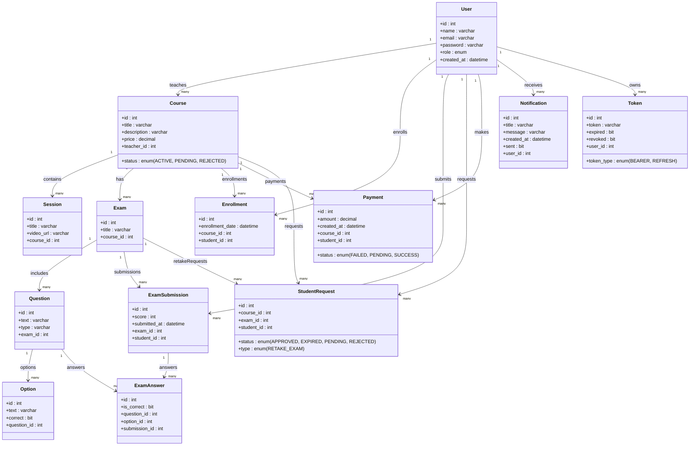
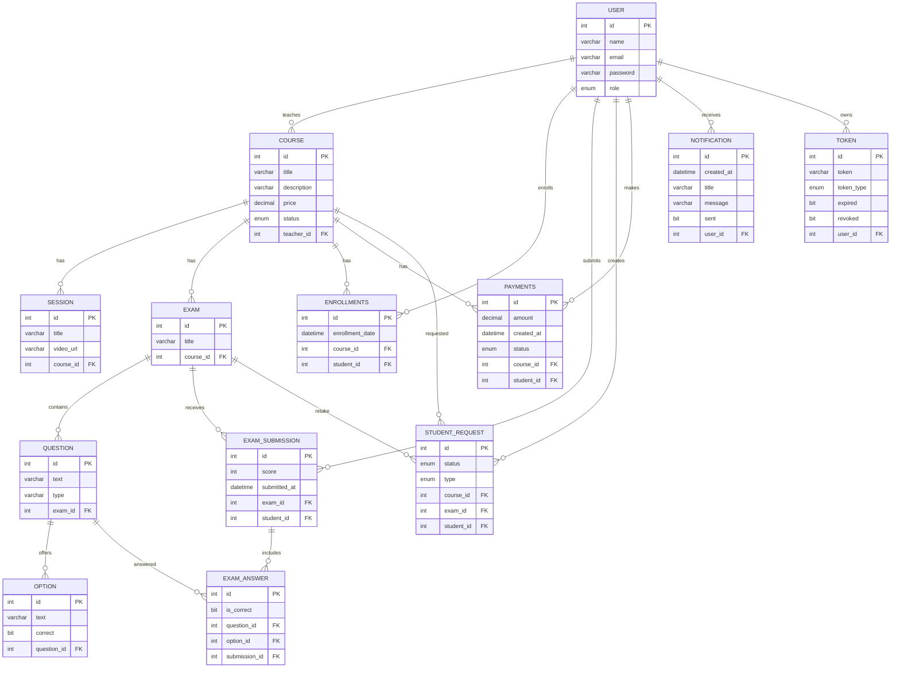

# 🏫 E-Learning Platform – Full Project Description

A complete **E-Learning Platform** supporting **3 types of users**:

👩‍🎓 **Student** – 👨‍🏫 **Teacher** – 🛠️ **Admin**  

✅ Full **Authentication & Authorization** implemented with **Spring Security + JWT** to ensure secure role-based access to all resources.

---

## ✨ Key Features

### 🛠️ Admin
* Approves or rejects teacher accounts with email and notification updates.
* Monitors student payments and manages all transactions.
* Activates or rejects courses after review, sending notifications to the respective teacher.
* Live Dashboard to track the entire platform .

### 👨‍🏫 Teacher
* Creates new courses and adds **sessions** (video lessons) with uploaded media.
* Adds exams with customizable questions and correct answers, and can update question options.
* Approves or rejects student requests (e.g., extra views, exam retakes) with instant notifications.
* Tracks student grades and exam results.
* Sends a request to add a new specialization if not available.
* Manages all details of their own courses securely.

### 👩‍🎓 Student
* Watches course videos with a limited number of views set by the teacher.
* Sends requests for extra views or exam retakes.
* Takes exams and sees results instantly.
* Accesses all available courses and past exams with full details.
* Can view course content (sessions, exams) **only** if enrolled in that course.

---

## 🛠️ Backend Tech Stack

- **Spring Boot** as the application framework.
- **Spring Security + JWT** for authentication and role-based authorization.
- **Spring Data JPA + Hibernate** for database operations.
- **MySQL** as the relational database.
- **Cloudinary** for media uploads (images, videos).
- **JavaMailSender** for email notifications (account/course approval or rejection).
- **WebSocket & SSE** for live notifications and dashboard data.
- **Lombok** to reduce boilerplate code (`@Data`, `@Builder`, etc.).
- **Validation API** for request data validation.
- **MapStruct / DTO Mapping** to separate entities from API responses.
- **Global Exception Handling** for consistent and clean error responses.
- **Swagger & Postman** for testing Apis.

---

## 📂 Major API Endpoints

| Role        | Key Endpoints |
|-------------|---------------|
| **Admin**   | Approve/Reject teacher accounts, Activate/Reject courses, Manage payments, Send notifications ,Live Dashboard. |
| **Teacher** | Create/Update/Delete courses, Add sessions (video lessons), Upload exams and questions, Update answers, Approve/Reject student requests. |
| **Student** | Enroll in courses, View enrolled course details, Access sessions of enrolled courses, Take exams and view results, Submit requests for retake or extra views. |
| **Auth**    | User registration (student/teacher), Login, Password reset. |

---

## 💡 Additional Features

* **Notifications System**  
  - Students receive notifications when their requests are approved or rejected.  
  - Teachers receive notifications when their accounts or courses are approved or rejected.  
  - Automatic email sending using scheduled tasks.

* **Profile Management**  
  - Each user has a profile page to view and update their information.

* **Payments**  
  - Integrated payment system to handle course enrollments under admin supervision.

---

## 🚀 Integration
- RESTful API ready for integration with any **Front-End** (Web or Mobile).
- Scalable for future enhancements such as live streaming or real-time chat using **WebSocket or SSE**.

---

## 📊 Value
A secure, scalable educational platform managing the entire learning process:  
**Course Creation → Content Management → Exams  → Notifications → Payments**.

# UML 

 
 # ERD

